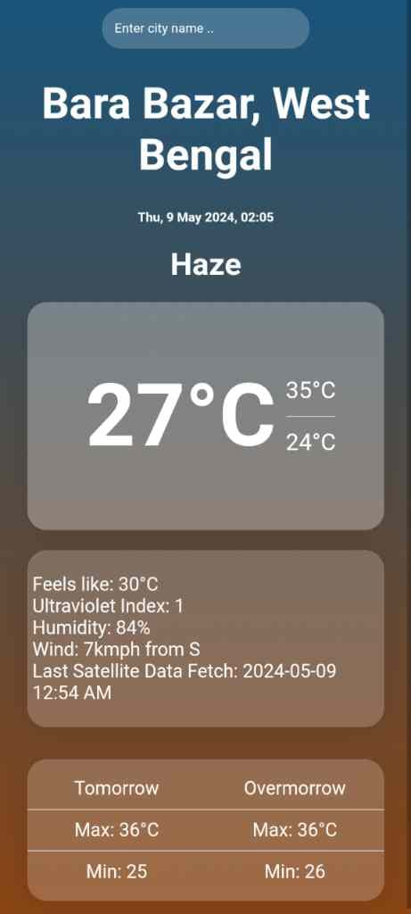

# Ronynn Weather

Welcome to Weather by Ronynn, a minimalist weather app inspired by iOS aesthetics and glassmorphism. This sleek and stylish app provides you with weather information in a format that looks stunning on any home screen.

## Features
- **Minimalist Design:** Enjoy a clean and clutter-free interface inspired by iOS aesthetics.
- **Glassmorphism:** Embrace the beauty of glassmorphism, adding depth and elegance to your weather experience.
- **Real-Time Weather Data:** Get up-to-date weather information fetched from the WTTR API.
- **Customizable:** Personalize your app with customizable themes to match your mood or style.

## How to Use
Simply install the app from chrome options and you're all set! Ronynn Weather will automatically fetch your local weather information and display it in a beautiful glassmorphic interface.

## Installation
1. Clone this repository to your local machine.
2. Open the `index.html` file in your web browser.

## Credits
Ronynn Weather is powered by the WTTR API for real-time weather data.

## Contributing
Ronynn weather currently isn't looking for any contributions, but feel free to suggest new features.

## Feedback
We'd love to hear your thoughts on Ronynn Weather! If you have any feedback, suggestions, or just want to say hi, don't hesitate to reach out to us.

Enjoy the weather in style with Ronynn Weather! 🌤️